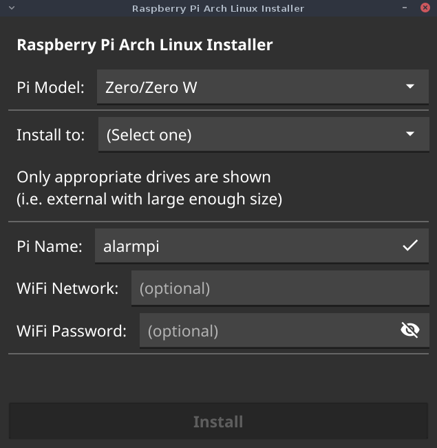

Raspberry Pi Archlinux Automated Installer with Wi-Fi. Windows, Mac and more features coming.

## Download

Go to [releases
page](https://github.com/oxplot/raspberrypi-archlinux-installer/releases)
and download the zip file for your OS.

Once downloaded, extract and run.

## Interactive and Batch modes

You can also run the installer in command line mode, either interactive
or completely hands free. Run with `--help` flag for details.
